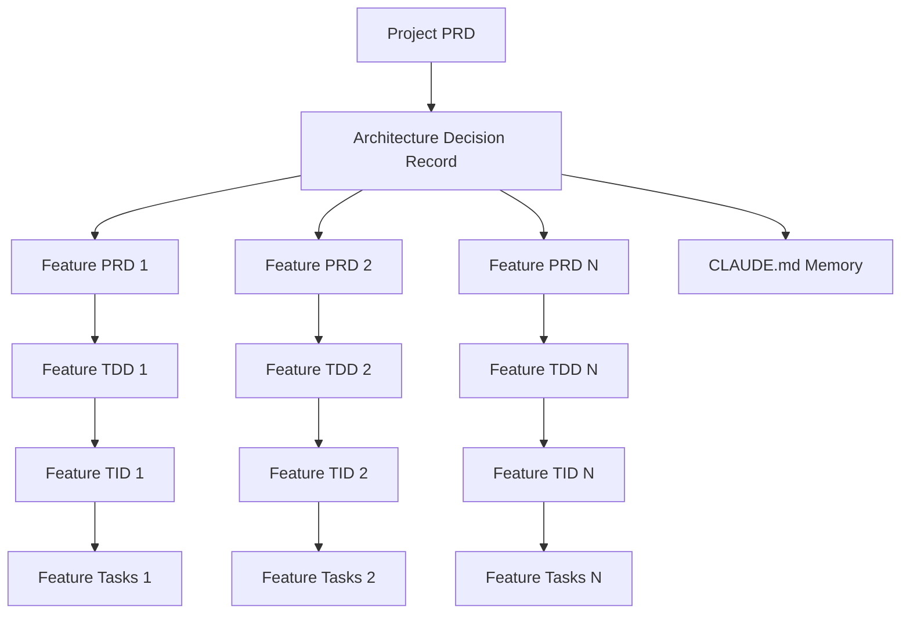

# AI Dev Tasks Framework

## Table of Contents
- [Overview](#overview)
- [Philosophy & Background](#philosophy--background)
- [Framework Architecture](#framework-architecture)
- [Instruction Documents](#instruction-documents)
- [Workflow Implementation](#workflow-implementation)
- [Context Management](#context-management)
- [Getting Started](#getting-started)
- [Best Practices](#best-practices)
- [Troubleshooting](#troubleshooting)

## Overview

The **AI Dev Tasks Framework** is a comprehensive methodology for AI-assisted software development that transforms high-level project ideas into detailed, actionable development tasks through a structured documentation workflow. This framework enables junior developers to build complex software projects systematically while maintaining consistency, quality, and clear progress tracking.

### What This Framework Does

- **Transforms Ideas → Code:** Converts abstract project concepts into concrete implementation tasks
- **Ensures Consistency:** Establishes technical standards that apply across all features
- **Enables Collaboration:** Creates clear documentation that any team member can follow
- **Supports Iteration:** Allows for pause/resume development across multiple sessions
- **Maintains Quality:** Built-in testing and review processes at every level

### Target Audience

- **Junior Developers** seeking structured guidance for complex projects
- **Development Teams** wanting consistent documentation and architecture standards
- **Project Managers** needing clear visibility into development progress
- **Technical Writers** documenting software development processes

## Philosophy & Background

### The Problem

Traditional software development often suffers from:
- **Inconsistent Architecture:** Different developers make conflicting technical decisions
- **Poor Documentation:** Features built without clear requirements or design docs
- **Context Loss:** Development stalls when team members switch or take breaks
- **Quality Issues:** Missing tests, inconsistent patterns, technical debt accumulation
- **Junior Developer Challenges:** Overwhelming complexity without clear guidance

### The Solution

This framework addresses these challenges through:

1. **Front-Loaded Planning:** All major decisions made before coding begins
2. **Layered Documentation:** Progressive detail from business goals to implementation tasks
3. **Standardized Processes:** Consistent approach for every feature and component
4. **Memory Systems:** Context preservation across sessions and team members
5. **Quality Gates:** Built-in review and testing requirements at each stage

### Core Principles

- **Documentation-First Development:** Think before you build
- **Progressive Elaboration:** Start broad, get specific incrementally  
- **Consistency Over Creativity:** Standardized approaches reduce cognitive load
- **Context Preservation:** Work should be resumable by anyone, anytime
- **Quality by Design:** Testing and review built into the process, not added later

## Framework Architecture

The framework follows a hierarchical structure that mirrors how humans naturally think about software projects:

```
Business Vision (Project Level)
    ↓
Technical Foundation (Architecture Level)  
    ↓
Feature Requirements (Product Level)
    ↓
Technical Design (System Level)
    ↓
Implementation Details (Code Level)
    ↓
Actionable Tasks (Development Level)
```

### Document Types & Relationships



## Instruction Documents

This section details each instruction document's purpose, approach, inputs, and outputs.

### 1. `001_create-project-prd.md`

**Purpose:** Creates the foundational project vision and feature breakdown

**Philosophy:** Establish the "why" and "what" before diving into "how"

**Process:**
- Gathers high-level project requirements through strategic questioning
- Defines target users, success criteria, and business objectives
- Breaks project into logical features with priority levels
- Sets scope boundaries and future roadmap considerations

**Inputs:**
- Project description from stakeholder/product owner
- Answers to strategic clarifying questions about scope, users, timeline, success metrics

**Outputs:**
- `000_PPRD|[project-name].md` in `/prds/` folder
- High-level feature list for subsequent detailed specification
- Business context for all technical decisions

**Key Questions Addressed:**
- What problem does this project solve?
- Who are the users and what do they need?
- How will we measure success?
- What's in scope vs. out of scope?

---

### 2. `002_create-adr.md`

**Purpose:** Establishes foundational technology choices and development standards

**Philosophy:** Make architectural decisions once, apply them consistently

**Process:**
- Analyzes project requirements from Project PRD
- Presents technology options with trade-offs for each decision area
- Creates comprehensive standards for code organization, testing, and quality
- Generates memory content for AI context in CLAUDE.md

**Inputs:**
- Project PRD reference for context and requirements
- User decisions on technology stack choices
- Answers to technical evaluation questions

**Outputs:**
- `000_PADR|[project-name].md` in `/adrs/` folder (full documentation)
- Project Standards section for CLAUDE.md (condensed memory)
- Technology stack decisions and architectural principles

**Technology Decision Areas:**
- Frontend/Backend frameworks
- Database and data management
- API design patterns
- Authentication and security
- Testing strategies
- Deployment approaches
- Development principles and tooling

---

### 3. `003_create-feature-prd.md`

**Purpose:** Creates detailed requirements for individual features

**Philosophy:** Translate business goals into implementable feature specifications

**Process:**
- References Project PRD and ADR for context and constraints
- Gathers feature-specific requirements through targeted questioning
- Defines user stories, acceptance criteria, and technical requirements
- Establishes feature boundaries and integration needs

**Inputs:**
- Feature selection from Project PRD feature breakdown
- Project PRD and ADR for context and standards
- Answers to feature-specific clarifying questions

**Outputs:**
- `[###]_FPRD|[feature-name].md` in `/prds/` folder
- Detailed functional and non-functional requirements
- User stories with acceptance criteria
- Integration specifications and dependencies

**Key Sections:**
- User stories and scenarios
- Functional requirements (numbered list)
- Technical constraints from ADR
- API/integration specifications
- Testing requirements

---

### 4. `004_create-tdd.md`

**Purpose:** Creates technical architecture and design for features

**Philosophy:** Bridge business requirements with implementation approach

**Process:**
- Analyzes Feature PRD for technical requirements
- Assesses current codebase patterns and architecture
- Makes high-level design decisions for the feature
- Provides architectural guidance without implementation details

**Inputs:**
- Feature PRD reference for requirements
- Existing codebase assessment
- Answers to technical design questions

**Outputs:**
- `[###]_FTDD|[feature-name].md` in `/tdds/` folder
- System architecture and component relationships
- Data design and API patterns
- Performance and security considerations
- Testing strategy and approach

**Design Areas:**
- Component architecture and relationships
- Data design patterns and validation strategy
- API design patterns and conventions
- State management approach
- Security and performance principles
- Testing philosophy and coverage strategy

---

### 5. `005_create-tid.md`

**Purpose:** Provides specific implementation guidance and coding hints

**Philosophy:** Translate design decisions into actionable implementation guidance

**Process:**
- Synthesizes Feature PRD and TDD requirements
- Performs deep analysis of existing codebase patterns
- Provides specific coding hints and implementation strategies
- Sets up direct input for task generation

**Inputs:**
- Feature PRD and TDD references
- Comprehensive codebase analysis
- Answers to implementation-specific questions

**Outputs:**
- `[###]_FTID|[feature-name].md` in `/tids/` folder
- File organization and naming patterns
- Component implementation hints and patterns
- Database and API implementation strategies
- Testing and quality guidelines

**Implementation Areas:**
- File structure and organization patterns
- Component design patterns and abstraction levels
- Database implementation approach and optimization hints
- API implementation strategy and error handling patterns
- Testing implementation approach and coverage strategy
- Code quality standards and review guidelines

---

### 6. `006_generate-tasks.md`

**Purpose:** Generates detailed, actionable development tasks

**Philosophy:** Break complex features into manageable, sequential work items

**Process:**
- Analyzes Feature PRD for functional requirements
- References TDD and TID for implementation approach
- Creates hierarchical task structure with parent tasks and sub-tasks
- Identifies all files that need creation or modification

**Inputs:**
- Feature PRD reference
- Optional TDD and TID references for enhanced context
- User confirmation to proceed from parent tasks to sub-tasks

**Outputs:**
- `[###]_FTASKS|[feature-name].md` in `/tasks/` folder
- Hierarchical task list with parent tasks and sub-tasks
- Relevant files section with creation/modification needs
- Testing requirements integrated into tasks

**Task Structure:**
- Parent tasks (high-level implementation phases)
- Sub-tasks (specific, actionable work items)
- File identification (all files needing attention)
- Testing integration (unit tests for each component)

---

### 7. `007_process-task-list.md`

**Purpose:** Guides task execution and progress tracking

**Philosophy:** Systematic implementation with quality gates and progress tracking

**Process:**
- Defines task completion protocols and quality gates
- Establishes git workflow for progress tracking
- Sets up testing and review requirements
- Ensures proper documentation of completed work

**Key Protocols:**
- One sub-task at a time with user permission for next
- Testing required before marking parent tasks complete
- Git commits with conventional commit format
- Progress tracking in task list file
- File maintenance for "Relevant Files" section

## Workflow Implementation

### Phase-by-Phase Workflow

#### Phase 1: Project Foundation (Session 1-2)
```bash
# Session 1: Project Vision
@instruct/001_create-project-prd.md
# Generate: 000_PPRD|[project-name].md

# Session 2: Technical Foundation  
@instruct/002_create-adr.md
@prds/000_PPRD|[project-name].md
# Generate: 000_PADR|[project-name].md
# Copy Project Standards to CLAUDE.md
```

#### Phase 2: Feature Development (Sessions 3-N)
For each feature from the Project PRD:

```bash
# Feature Requirements Session
@instruct/003_create-feature-prd.md
@prds/000_PPRD|[project-name].md
@adrs/000_PADR|[project-name].md
# Generate: 001_FPRD|[feature-name].md

# Technical Design Session
@instruct/004_create-tdd.md
@prds/001_FPRD|[feature-name].md
# Generate: 001_FTDD|[feature-name].md

# Implementation Planning Session
@instruct/005_create-tid.md
@prds/001_FPRD|[feature-name].md
@tdds/001_FTDD|[feature-name].md
# Generate: 001_FTID|[feature-name].md

# Task Generation Session
@instruct/006_generate-tasks.md
@prds/001_FPRD|[feature-name].md
# Generate: 001_FTASKS|[feature-name].md

# Implementation Sessions
@instruct/007_process-task-list.md
@tasks/001_FTASKS|[feature-name].md
# Execute tasks with progress tracking
```

### File Structure Layout

```
project-root/
├── CLAUDE.md                                   # Project memory and standards
├── prds/
│   ├── 000_PPRD|Project_Name.md               # Project PRD
│   ├── 001_FPRD|Feature_A.md                  # Feature PRDs
│   ├── 002_FPRD|Feature_B.md
│   └── 003_FPRD|Feature_C.md
├── adrs/
│   └── 000_PADR|Project_Name.md               # Architecture Decision Record
├── tdds/
│   ├── 001_FTDD|Feature_A.md                  # Technical Design Documents
│   ├── 002_FTDD|Feature_B.md
│   └── 003_FTDD|Feature_C.md
├── tids/
│   ├── 001_FTID|Feature_A.md                  # Technical Implementation Documents
│   ├── 002_FTID|Feature_B.md
│   └── 003_FTID|Feature_C.md
├── tasks/
│   ├── 001_FTASKS|Feature_A.md                # Task Lists
│   ├── 002_FTASKS|Feature_B.md
│   └── 003_FTASKS|Feature_C.md
├── docs/
│   └── [Additional project documentation]
└── instruct/
    ├── 000_README.md                           # This document
    ├── 001_create-project-prd.md
    ├── 002_create-adr.md
    ├── 003_create-feature-prd.md
    ├── 004_create-tdd.md
    ├── 005_create-tid.md
    ├── 006_generate-tasks.md
    └── 007_process-task-list.md
```

## Context Management

### Memory Architecture

The framework uses a multi-layered memory system to enable seamless pause/resume operations:

#### 1. CLAUDE.md - Primary Memory File
```markdown
# Project: [Your Project Name]

## Current Status
- **Phase:** [Current development phase]
- **Last Session:** [Date and brief summary]
- **Next Steps:** [Specific next actions]
- **Active Document:** [Document currently being worked on]

## Project Standards
[Auto-generated from ADR - technology stack, coding patterns, architecture principles]

## Document Inventory
### Completed Documents
- ✅ 000_PPRD|Project_Name.md
- ✅ 000_PADR|Project_Name.md
- ✅ 001_FPRD|Feature_A.md
- ⏳ 001_FTDD|Feature_A.md (in progress)
- ❌ 001_FTID|Feature_A.md (pending)

### Feature Priority Order
1. Feature A (Core/MVP)
2. Feature B (Important)  
3. Feature C (Future)

## Session Context Commands
- Use `/compact` for session summaries
- Use `@CLAUDE.md` to reload project context
- Use `@prds/000_PPRD|Project_Name.md` for project overview
```

#### 2. Session Resume Protocol

**Every Session Start:**
```bash
# 1. Get session context
/compact
# Reviews: "Working on [Project] documentation. Currently at [phase]. Need to [action]."

# 2. Load project memory
@CLAUDE.md

# 3. Load current work area  
@prds/  # or @tdds/ @tids/ @tasks/ depending on current phase

# 4. Proceed with work
```

#### 3. Session End Protocol

**Before Every Break:**
```bash
# 1. Update CLAUDE.md status
# Edit current status, last session summary, next steps

# 2. Create session summary
/compact "Completed [specific accomplishments]. Next: [specific next action]."

# 3. Commit progress
git add .
git commit -m "docs: completed [task] - Next: [specific action]"
```

#### 4. Context Recovery Strategies

**Mild Context Loss:**
```bash
@CLAUDE.md                    # Load project memory
ls -la */                    # Check file completion status  
@instruct/[current-phase].md  # Load current instruction
```

**Severe Context Loss:**
```bash
@CLAUDE.md                           # Project memory
@prds/000_PPRD|[project-name].md     # Project foundation
@adrs/000_PADR|[project-name].md     # Technical standards
ls -la */                           # Assess completion status
@instruct/                          # Review methodology if needed
```

### Progress Tracking Systems

#### 1. Document Status Tracking
- **✅ Complete:** Document finished and reviewed
- **⏳ In Progress:** Currently being worked on  
- **❌ Pending:** Not yet started
- **🔄 Needs Update:** Requires revision based on changes

#### 2. Session Logging
Each session should update CLAUDE.md with:
- Date and duration
- Documents worked on
- Key decisions made
- Next session objectives
- Any blockers or questions

#### 3. Git Workflow Integration
```bash
# Feature branch for documentation phase
git checkout -b docs/feature-planning

# Regular commits with conventional commit format
git commit -m "docs(prd): complete user authentication feature requirements"
git commit -m "docs(tdd): define authentication component architecture"  
git commit -m "docs(tid): specify JWT implementation patterns"
git commit -m "docs(tasks): create authentication task breakdown"

# Merge when feature documentation complete
git checkout main
git merge docs/feature-planning
```

## Getting Started

### Prerequisites

- **Claude Code CLI** installed and configured
- **Git** for version control and progress tracking
- **Text Editor** with Markdown support (VS Code recommended)
- **Basic understanding** of software development concepts

### Quick Start Guide

#### Step 1: Initialize Project Structure
```bash
# Create project directory
mkdir my-awesome-project
cd my-awesome-project

# Initialize git
git init

# Create folder structure
mkdir -p prds adrs tdds tids tasks docs instruct

# Create initial CLAUDE.md
touch CLAUDE.md
```

#### Step 2: Set Up Framework Files
```bash
# Copy instruction files to instruct/ folder
# (From this framework repository)
cp framework/instruct/* instruct/

# Verify instruction files
ls instruct/
# Should show: 000_README.md through 007_process-task-list.md
```

#### Step 3: Start Documentation Workflow
```bash
# Start Claude Code session
claude-code

# Begin with Project PRD
@instruct/001_create-project-prd.md

# Follow the guided process...
```

### Sample Timeline

**Week 1: Foundation**
- Day 1-2: Project PRD and ADR creation
- Day 3-4: CLAUDE.md setup and first feature PRD

**Week 2-N: Feature Development**
- 2-3 days per feature for complete documentation cycle
- PRD → TDD → TID → Tasks for each feature
- Adjust timeline based on feature complexity

### Success Metrics

You'll know the framework is working when:
- **Context Resumes Smoothly:** Any team member can pick up work after breaks
- **Decisions Are Consistent:** All features follow established patterns
- **Quality Is Built-In:** Testing and review requirements are clear
- **Progress Is Visible:** Anyone can see project status at a glance
- **Implementation Is Smooth:** Developers have clear, actionable tasks

## Best Practices

### Documentation Quality

1. **Be Specific, Not Generic**
   - ❌ "Add user management"
   - ✅ "Create user registration form with email validation, password strength requirements, and email confirmation workflow"

2. **Reference Context Explicitly**
   - Always reference related documents: `@prds/000_PPRD|Project_Name.md`
   - Link to ADR decisions: "Following JWT approach per ADR section 2.3"

3. **Update Status Religiously**
   - Update CLAUDE.md after every session
   - Use consistent status indicators (✅⏳❌🔄)
   - Include specific next steps, not vague intentions

### Session Management

1. **Start Every Session with Context Loading**
   ```bash
   /compact
   @CLAUDE.md
   ls -la */
   ```

2. **End Every Session with Status Update**
   - Update CLAUDE.md current status
   - Create specific `/compact` summary
   - Commit progress with clear message

3. **Break Work into Session-Sized Chunks**
   - Single document per session ideally
   - Complex documents can span 2-3 sessions max
   - Always end at logical stopping points

### Quality Gates

1. **Don't Skip Steps**
   - Every feature needs PRD → TDD → TID → Tasks progression
   - Each step validates and builds on the previous
   - Shortcuts lead to inconsistency and rework

2. **Review Before Proceeding**
   - Review each document before starting the next
   - Check alignment with ADR standards
   - Validate against Project PRD goals

3. **Test the Documentation**
   - Can a junior developer follow your tasks?
   - Are all dependencies clearly identified?
   - Is the acceptance criteria measurable?

## Troubleshooting

### Common Issues and Solutions

#### "I Lost Context Between Sessions"
**Solution:** Follow the Context Recovery protocol
```bash
@CLAUDE.md                           # Load project memory
@prds/000_PPRD|[project-name].md     # Project foundation  
@adrs/000_PADR|[project-name].md     # Technical standards
ls -la */                           # Check completion status
```

#### "The Tasks Don't Match the Requirements"
**Solution:** Check the document chain
1. Verify TID references correct PRD and TDD
2. Ensure TDD addresses all PRD requirements  
3. Confirm ADR standards are being followed
4. Regenerate tasks with proper context

#### "Documents Are Inconsistent"
**Solution:** ADR standards not being followed
1. Review ADR and update CLAUDE.md if needed
2. Check that each document references ADR decisions
3. Update inconsistent documents to match standards
4. Add ADR references to instruction prompts

#### "Progress Tracking Is Confusing"
**Solution:** Improve CLAUDE.md maintenance
1. Use consistent status indicators (✅⏳❌🔄)
2. Update after every session, no exceptions
3. Include specific next steps, not vague goals
4. Reference exact document names and numbers

#### "Tasks Are Too Vague or Too Detailed"
**Solution:** Adjust TID implementation hints
- Too vague: Add more specific implementation patterns to TID
- Too detailed: Focus TID on patterns and approaches, not exact code
- Inconsistent: Review instruction documents for clarity

### Getting Help

1. **Review Instruction Documents:** Each has specific guidance for its phase
2. **Check CLAUDE.md:** Verify project standards are properly loaded
3. **Validate Document Chain:** Ensure each document builds properly on previous ones
4. **Use `/compact` Summaries:** Help AI understand where you are in the process

---

## Conclusion

The AI Dev Tasks Framework transforms chaotic software development into a systematic, repeatable process. By front-loading planning and maintaining consistent documentation standards, teams can build complex software with confidence, clarity, and quality.

The framework's strength lies not just in its structured approach, but in its memory systems that enable seamless collaboration and context preservation. Whether you're a junior developer tackling your first major project or an experienced team seeking better consistency, this framework provides the scaffolding for successful software development.

Remember: **Think first, then build.** The time invested in proper documentation and planning pays dividends throughout the development lifecycle and beyond.

---

*Framework Version: 1.0*  
*Last Updated: [Current Date]*  
*License: [Your License Choice]*