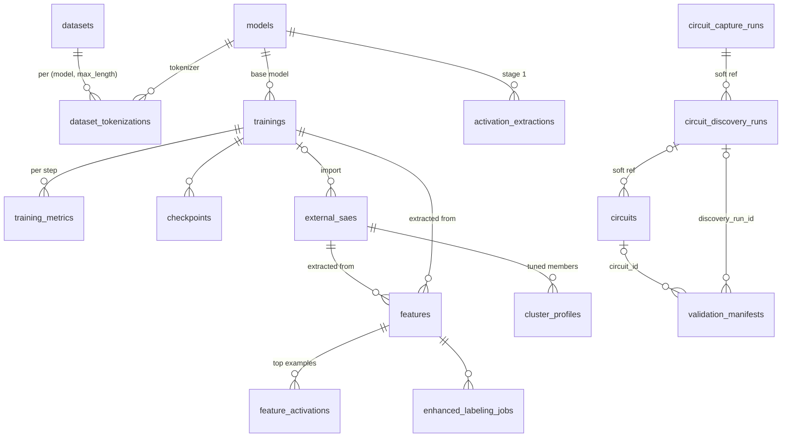

# Data Model

miStudio stores all metadata in PostgreSQL (heavy artifacts — weights, activations — live on the filesystem, referenced by path). This page maps the tables and their relationships. Every table in the ORM is listed here — enforced by `test_data_model_doc_covers_every_table`, which diffs this page against `Base.metadata` and fails when one is missing. (It previously claimed to be "verified against the ORM models" while omitting nine tables, including one its own ER diagram draws.)

## Pipeline tables

### `datasets`
`id UUID` · `name`, `source`, `hf_repo_id` · `status` (`downloading|processing|ready|error`) · `progress`, `error_message` · `raw_path`, `num_samples`, `size_bytes` · token-filter settings (`tokenization_filter_enabled`, `tokenization_filter_mode`, `tokenization_junk_ratio_threshold`) · `metadata` JSONB

### `dataset_tokenizations`
`id` = `tok_{dataset}_{model}_{maxlen}` · FKs `dataset_id`, `model_id` · `max_length`, `tokenized_path`, `tokenizer_repo_id`, `vocab_size`, `num_tokens`, `avg_seq_length` · `status` (`queued|processing|ready|error`) · `celery_task_id` · punctuation-filter options · block order: `shuffled`, `shuffle_seed` · **UNIQUE `(dataset_id, model_id, max_length)`** — one tokenization per model+length

`shuffled` and `shuffle_seed` are nullable with no default, and **NULL means not recorded** rather
than false. Tokenizations written before these columns existed are in corpus order, and say so by
declining to claim otherwise. `shuffle_seed` is NULL both when nothing was recorded and when a row
was recorded as unshuffled — read `shuffled` to tell those apart. `0` is a legitimate seed, not a
sentinel.

### `models`
`id` = `m_{uuid}` · `name`, `repo_id` · `architecture` (family) + `architecture_config` JSONB (discovered dims) · `params_count` · `quantization` (`FP32|FP16|Q8|Q4|Q2`) · `status` (`downloading|loading|quantizing|ready|error`) · `file_path`, `quantized_path` · `memory_required_bytes`, `disk_size_bytes` · `celery_task_id`

### `trainings`
`id` = `train_{uuid}` · FK `model_id` · `dataset_id` **and** `dataset_ids` JSONB (multi-dataset) · `extraction_id` and `extraction_ids` JSONB (cached-activation training) · `status` (`pending|initializing|running|paused|completed|failed|cancelled`) · `progress`, `current_step`, `total_steps` · `hyperparameters` JSONB · live stats (`current_loss`, `current_l0_sparsity`, `current_fvu` (legacy), `current_fvu_centred`, `current_dead_neurons`, `current_learning_rate`) · `evaluation` JSONB (see below) · `celery_task_id`, `checkpoint_dir`, `finalized_from_step`, `error_traceback`

### `training_metrics`
`id BigInteger` · FK `training_id` · `step`, `timestamp`, `layer_idx` (NULL = aggregated series; `-1 - layer` = held-out rows) · `hook_type` (the SAE's hook on per-SAE and held-out rows; NULL on aggregated rows and on rows written before migration `d5a1f3c7e9b2`) · `loss`, `loss_reconstructed`, `loss_zero`, `l0_mean`, `l0_sparsity`, `l1_sparsity`, `dead_neurons`, `fvu` (legacy), `fvu_centred`, `learning_rate`, `grad_norm` (the total gradient norm **before** clipping, so a value above `grad_clip_norm` is one the clip brought down; written on per-SAE rows only, and only on steps that clipped — NULL when `grad_clip_norm` is unset, on aggregated and held-out rows, and on every row written before 2026-09-16), `gpu_memory_used_mb`, `samples_per_second` · **UNIQUE index `(training_id, step, layer_idx, COALESCE(hook_type, ''))`** (aggregated rows, with `layer_idx` NULL, are not constrained)

### `external_saes`
`id` = `sae_{uuid}` · `source` (`huggingface|local|trained`) · `status` (`pending|downloading|converting|ready|error|deleted`) · HF fields (`hf_repo_id`, `hf_filepath`, `hf_revision`) · `training_id` FK (nullable — external SAEs have none) · `model_name`, `model_id` FK, `layer`, `hook_type` · `n_features`, `d_model`, `architecture` · `format` (e.g. `community_standard`) · `local_path`, `file_size_bytes` · `sae_metadata` JSONB

## Feature tables

### `features`
`id` = `feat_{training}_{neuron}` or `feat_sae_{sae}_{neuron}` · FKs `training_id` / `external_sae_id` (one nullable), `extraction_job_id`, `labeling_job_id` · `neuron_index` · `name`, `category`, `description`, `notes` · `label_source` (`auto|user|llm|local_llm|openai|enhanced_llm`) · indexed stats: `activation_frequency`, `interpretability_score`, `max_activation`, `mean_activation` · `is_favorite`, `star_color` (`yellow|purple|aqua|null`) · `example_tokens_summary` JSONB, `nlp_analysis` JSONB, `nlp_processed_at`

**Adjudication state** — the OUTCOME of a labeling attempt, kept separate from
the verdict. `label_status` (`pending|in_progress|succeeded|failed|skipped`),
`label_attempts`, `label_error`, `label_error_at`, `labeled_at`,
`label_prompt_fingerprint` (sha256 of the prompt-affecting template fields) and
`label_model` (the judge that produced the verdict), and the judge's own
self-assessment of that verdict: `label_fit_count` (`"F/N"`, how many of the
examples shown its hypothesis explains) and `label_confidence`
(`high|medium|low`). Both are NULL when not recorded — labels written before
they existed, or by a template that does not ask. A reported fit below 60%
turns the label into `uninterpretable` whatever the judge named it; the
self-assessment is kept so that override can be audited. `category` carries the
semantic answer; `label_status` carries what happened. Conflating them is what
let 16,824 failed features look finished.

**Two activation frequencies, and they mean different things.**
`activation_frequency` is counted from the examples extraction emits, i.e.
**after** the junk-token filter has discarded any (document, feature) pair whose
peak landed on a filtered token — so it reads "fraction of samples where the
peak was on a kept token". It feeds the dead-feature gate and the steering
auto-baseline, whose constants were fitted against it, and is therefore left
unchanged. `activation_frequency_true` and `activation_count_true` are the same
quantity counted **before** the filter; both are NULL on extractions that
predate the measurement, which is the honest encoding — those runs did not take
it. The ratio between the two is how much the filter distorts a given feature.

### `feature_activations`
Composite PK `(id, feature_id)`, **range-partitioned by `feature_id`** for scale · `sample_index`, `max_activation` · `tokens` + `activations` JSONB (per-token values) · context split: `prefix_tokens` / `prime_token` / `suffix_tokens`, `prime_activation_index` · `dataset_id` — which corpus of the mixture this example came from

`sample_index` is a **global** offset into the concatenated mixture, so it stays unique across
corpora within one extraction. `dataset_id` is provenance, not disambiguation: it is what makes
per-corpus statistics possible. It is nullable, and NULL on rows written before the column
existed.

## Circuit & cluster tables

The circuit subsystem records discovered cross-layer structures and the tuned clusters that steer them. Heavy artifacts (capture event stores) live on the filesystem under `/data/circuit_captures/{id}/`; these tables hold the metadata and contract-shaped JSONB snapshots.

### `circuits`
`id` = `crc_{hex12}` · `name`, `narrative` (markdown), `granularity` (`feature|cluster`) · contract-shaped JSONB snapshots mirroring `mistudio.circuit-definition/v1`: `saes`, `members`, `edges`, `budget`, `faithfulness`, `calibration` (the two-detector usable-band result — onset, correctness cliff, clamped intensity range; IDL-37), `discovery` (provenance) · `rung` (denormalized min-over-edges evidence rung) · `promoted` (a promoted circuit **is** the loadable multi-layer steering profile) · `version` (optimistic-concurrency — a stale write 409s) · `discovery_run_id` (soft ref) · `model_id`, `model_hf_id` (cross-instance-stable) · faithfulness lifecycle (`faithfulness_status` `pending|running|completed|failed`, `faithfulness_task_id`) · **calibration lifecycle** (`calibration_status` `pending|running|completed|failed`, `calibration_task_id`) · `schema_version` · `created_at`, `updated_at` · index `(promoted, rung)`

### `circuit_capture_runs`
`id` = `cap_{hex12}` · `status` (`pending|estimating|running|completed|failed|cancelled`), `progress` (0–100), `error_message` · `manifest` JSONB (mirrors the on-disk `manifest.json`: corpus refs, per-layer SAE/threshold, split, counts, SAE fingerprints, optional attention capture) · `store_path`, `events_total`, `bytes_total` · `stale` (flagged, not deleted, when a referenced SAE changes) · `celery_task_id` · `created_at`, `updated_at`

### `circuit_discovery_runs`
`id` = `dsc_{hex12}` · `capture_run_id` (soft ref) · `status`, `progress`, `error_message` · `params` JSONB (granularity, seeded/open mode, seed refs, `s_min`, null shuffles, FDR `q`, cohesion floor) · `report` JSONB (null summary, FDR discipline, held-out replication rate, counts-by-stage, attribution envelope) · `candidates` JSONB (both orderings — coactivation-only and attribution-re-ranked; cap 2000) · **separate attribution lifecycle** (`attribution_status`, `attribution_progress`, `attribution_error`, `attribution_task_id`) · **separate validation lifecycle** (`validation_status`, `validation_progress`, `validation_error`, `validation_task_id`) · `celery_task_id` · `created_at`, `updated_at`

### `validation_manifests`
`id` = `vman_{hex12}` · `kind` (`edge_batch|faithfulness|reproduction|calibration|steering_samples`) · self-contained: soft parent refs `discovery_run_id`, `circuit_id`, `parent_manifest_id` (a reproduction → its source) · `payload` JSONB (everything needed to REPRODUCE the run — intervention config, baseline, prompts, seeds, cfg, null summary, per-edge/member values, `metric_id`) · `created_at` · indexes on `discovery_run_id` and `circuit_id`

:::note Manifests are the record, not a live join
A manifest carries no drift-prone live references — reproduction is the correctness test. Manifest ids travel into the portable circuit contract as `validation_manifest_ref`, so an exported circuit's causal claims point at a reproducible record.
:::

### `steering_record_runs`
In-flight marker for the Steered Transcript Recorder (records `(dial, prompt, unsteered, steered)` transcripts for a strong model to analyze after the run). A record job loads the GPU like calibration, so it must be visible to the single-GPU guard — but it may target a cluster or ad-hoc feature set with no circuit row, so the marker lives here.
`id` = `srr_{hex12}` · `status` (`pending|running|completed|failed`), `task_id` · `artifact_kind` (`circuit|cluster|features`), `artifact_ref` (circuit id / cluster-profile id; `null` for a bare feature set) · `manifest_ref` (the `steering_samples` manifest it produced) · `error` · `created_at`, `updated_at`

### `cluster_profiles`
`id` = `clp_{hex12}` · `sae_id` FK → `external_saes` (`RESTRICT` on delete; nullable for imported-unbound profiles) · `model_id`, `extraction_id` (soft context), `source_group_id` (soft ref — grouping tables are recomputable and must not destroy tuned work) · `name`, `narrative` (markdown), `display_token` · `members` JSONB (per-member `feature_idx`, `label`, `similarity`, `activation_frequency`, `max_activation`, `strength`, `sign`, `pinned`) · `budget` JSONB (`B`, `B_dir`, `G`, `f_eff`, `formula_id`, `constants`, `intensity`, `intensity_range`) · `schema_version` · `imported_from` JSONB (import provenance) · `created_at`, `updated_at` · index `(sae_id, name)` · serializes to `mistudio.cluster-definition/v1`

## Job & support tables

| Table | Purpose |
|-------|---------|
| `activation_extractions` | Stage-1 raw-activation capture jobs (per model) |
| `extraction_jobs` | Stage-2 SAE→feature extraction jobs |
| `labeling_jobs` | Bulk labeling runs |
| `enhanced_labeling_jobs` | Per-feature two-pass labeling runs |
| `labeling_trial_runs` | Prompt-template A/B results over a fixed feature panel. A trial writes labels **here only** — never onto `features` — so comparing template variants cannot destroy the labels under comparison. `panel_id` is content-addressed (`sha256(extraction_job_id \| sorted feature ids)`), so equal ids prove an identical panel and a comparison can refuse a mismatch. `labeling_job_id` is `ON DELETE SET NULL`: deleting the job that produced a measurement must not delete the measurement. |
| `labeling_jobs.skip_adjudicated` | Whether a whole-extraction job skips features that already carry a verdict. **Defaults to false** — a full relabel, which is what pressing Label has always done. Defaulting it true would silently repurpose an existing control, so the choice is visible and opt-in. |
| `labeling_resume_sweeps` | A multi-batch labeling resume, one batch per Celery task. Finishing a 53k-feature extraction is ~27 batches of 2000 at ~8 s/feature; a task that looped over them would exceed the 10 h soft limit and, on an `acks_late` queue, strand its message for the full 12 h visibility timeout — so a sweep is a ROW plus a task that re-enqueues itself. `max_batches` is NOT NULL with no default, because an open-ended sweep is a request to spend an unknown number of GPU-hours. Progress counters come from what each batch actually WROTE, never from batch count: a sweep whose every batch failed must not report itself complete. |
| `neuronpedia_export_jobs` | ZIP export jobs |
| `neuronpedia_pushes` | Direct-push jobs (`push_{sae}_{ts}`, status `queued|preparing|pushing|completed|failed`) |
| `steering_experiments` | Saved steering results |
| `prompt_templates` | Steering prompt sets — `prompts` is a JSONB *array* (multi-prompt) |
| `training_templates`, `extraction_templates`, `labeling_prompt_templates` | Saved configurations |
| `app_settings` | Key-value settings; sensitive values AES-256-GCM encrypted |
| `task_queue` | Persistent background-job records backing the Monitor page |
| `gpu_leases` | Which job holds each GPU (multi-GPU Phase 3). One row per card, keyed by its UUID, so the primary key itself refuses a second holder; a job split across cards holds one row per card, taken in one transaction or not at all. A lease expires unless its holder renews it, so a worker killed mid-job frees its card. Job rows record the card in `gpu_uuid` (the first card) and, for a model split across GPUs, every card in `gpu_uuids`. |

:::note Two extraction tables, on purpose
`activation_extractions` (model → raw activations) and `extraction_jobs` (SAE → features) are distinct pipelines that share a word — see [The Extraction Pipeline](/concepts/extraction-pipeline).
:::

### `trainings.finalized_from_step`

Nullable integer. Set when a stopped run was finalized from a checkpoint, and
`NULL` for runs that completed normally.

A finalized run has `status = 'completed'` so the SAE import path unlocks, but
`progress` and `current_step` keep their real values. This column is what
distinguishes a salvaged run from one that reached `total_steps`, and it drives
the "Finalized early @ N" badge. See
[Training Lifecycle & Checkpoints](/core-workflow/training-lifecycle).

### Two FVU columns: `fvu` and `fvu_centred`

`training_metrics.fvu_centred` and `trainings.current_fvu_centred` hold the standard FVU,
`Σ‖x − x̂‖² / Σ‖x − μ‖²` with `μ` the mean of each dimension, computed on raw activations. This is
the value the UI shows as **FVU**.

`fvu` and `current_fvu` keep the meaning they have always had: `var(x − x̂) / var(x)` with a single
mean over every element. On activations with large constant dimensions this legacy value reads
lower than the standard one (0.26 against 0.32 at LFM2.5-1.2B layer 11). Rows written before
2026-09-15 have only the legacy value, and their `fvu_centred` is `NULL`. Nothing was backfilled,
because the activations needed to compute it are not stored with the row.

### `trainings.evaluation`

Nullable JSONB, written by the post-run evaluation and by `POST /trainings/{id}/evaluate`. It is a
single document, replaced on each run:

| Key | Content |
|-----|---------|
| `status` | `pending` · `running` · `completed` · `failed` · `skipped` · `cancelled` (stopped between batches) |
| `progress` | While running: `stage` (`loading_model`, `means`, `cross_entropy`), `batches_done`, `batches` |
| `stop_requested_at` | When a Stop of the evaluation was requested; absent otherwise |
| `stop_requested_by` | The control that requested it: `stop` or `stop_and_finalize` |
| `reason` | Why it failed or was skipped |
| `trigger` | `post_run` or `rerun` |
| `task_id`, `started_at`, `completed_at`, `updated_at` | Bookkeeping |
| `config` | `token_budget`, `batch_tokens`, `seed` |
| `sources[]` | Per tokenization: `label`, `dataset_path`, `total_rows`, `rows_read_by_training`, `unseen_rows`, `weight`, `blocks_evaluated` |
| `tokens`, `predicted_tokens`, `ce_base` | Real tokens read, next-token positions scored, and CE with the model untouched |
| `layers[]` | Per residual SAE: `layer`, `hook_type`, `ce_spliced`, `ce_mean_ablated`, `ce_zero_ablated`, `ce_delta`, `loss_recovered_vs_mean`, `loss_recovered_vs_zero`, `kl`, `l0`, `fvu_centred`, `fvu_legacy` |
| `all_layers_spliced` | `layers`, `ce`, `ce_delta`, `kl` with every SAE spliced at once |
| `skipped_saes[]` | SAEs that cannot be spliced (non-residual hooks, transcoders), with the reason |

An undefined number, such as a loss recovered whose denominator is zero, is stored as `null`, never
`NaN`. The evaluation reads only rows at or above each extraction's `max_samples` — see
[Model-Cost Evaluation](/core-workflow/sae-training#model-cost-evaluation). Before this column
existed, the spliced-CE step wrote its numbers into `training_metrics` rows with
`layer_idx = -1000 - layer`, in columns meant for other quantities. It no longer writes those rows.

## Probe monitors (Feature 032)

A probe monitor is a linear readout over one decoder layer's `resid_post`
activations — `score_t = w·ẑ_t + b` — followed by a combining rule that turns
per-token scores into one score for the whole input. Five tables carry it.

| Table | Purpose |
|---|---|
| `probe_monitor_datasets` | A label-mapped **view** over a downloaded dataset — not a copy. It records the input and label columns, the `label_mapping` (`{raw value: positive \| negative \| excluded}`), an optional keyword filter, and the `counts` that mapping produced. One download serves several views, which is the normal case: a repo's `training` config trains a probe while its `*_balanced` configs evaluate it. `role` separates `train`, `eval` and `calibration`, and they are not interchangeable — a calibration set supplies **negatives** for the false-positive-rate threshold and is not labelled for the concept at all, so it may never map a value to `positive`. `distribution` marks an evaluation set as in- or out-of-distribution, which is what rung 2 turns on. |
| `probe_monitor_runs` | One GPU job: render → pooled capture across the swept layers → layer selection → token capture at the chosen layers → train each rule → calibrate → evaluate → rung. `layer_selection` holds the **full** layer × pooling grid with each cell's validation AUROC, not only the winner, so a near-tie is visible; `environment` holds what FR-15 requires to reproduce the run (model revision, dtype, chat-template hash, dataset revisions, seeds, per-stage wall times). |
| `probe_monitors` | One trained probe: a `layer`, a `rule`, and a `variant` (`dense` or a k-sparse `sae` probe over selected SAE features). `threshold` is the operating point calibrated at `target_fpr`, and it is **not** a quality number — `realised_fpr` records what that threshold actually spends and `threshold_source` says whether it came from a held-out calibration set or from validation negatives, which are different claims. `streamable` says the rule has an exact online form. `rung` is a `ProbeRung`, never a causal claim. |
| `probe_monitor_evaluations` | One probe scored on one probe dataset. **A refusal is a row:** below 20 examples of either class the row is written with `status` refused and the reason in `metrics`, never omitted and never given a 0.5 — a missing row reads as "not run yet", and 0.5 reads as "measured, and chance". |
| `probe_monitor_judge_runs` | An LLM monitor over the same evaluation sets, as the **baseline a probe is compared against**. Rung 3 is "judge-compared", which claims the two were measured on the same data and says nothing about the judge being right. `parse_failures` is a column because a judge whose replies stop parsing yields a silently smaller sample; over the configured share the run refuses rather than reporting the remainder. |

Deleting a run deletes its probes, and deleting a probe deletes its evaluations.
Deleting an **SAE** does not delete a probe trained over it: the probe becomes
unbuildable, and that is a state to report rather than erase.

### Dataset downloads are identified by (repo, config, split)

Feature 032 changed the download identity. The raw directory is
`<datasets_dir>/<org>_<name>[__<config>][__<split>]` and the duplicate guard
compares all three, so the seven configs of one repo are seven datasets. With no
config and no split the path is byte-identical to the previous one, so rows
already on disk keep their paths. The display name carries the config, because
seven rows sharing one name are unusable in a list.

## Tables this page used to omit

Nine tables were undocumented until MIS-E2E-050. Three of them mattered
particularly: `checkpoints` is drawn in this page's own ER diagram above and had
no entry; the four `feature_group*` / `feature_token_index` tables back three
shipped features and the entire Feature Groups panel; and
`agent_approval_requests` is the gate deciding whether an MCP agent's
destructive action needs a human.

| Table | Purpose |
|---|---|
| `checkpoints` | Per-step training checkpoints — loss, L0, weights path; after a resume, `extra_metadata` carries `resume_history`. Beside each step's weights sits `training_state.pt`, which holds everything an exact resume restores: each SAE's optimizer moments, scheduler, GradScaler, dead-latent tracker (including **which** latents each of the most recent resamples revived, which nothing else records — the step counter beside it reads zero both for a revived latent and for one that merely fired) and activity statistics, plus the best loss, the random-number state, the activation source's data position, the storage `activation_plan` and `resume_history`. It is about twice the size of the weights, and three times when the step ends inside a gradient-accumulation window, which also saves the gradients. One row per layer per step on a multi-layer run. Drawn in the ER diagram above; subject to step-granular retention (see [Training Lifecycle](/core-workflow/training-lifecycle)). |
| `feature_groups` | A cluster of related features (PPRD rows 13–15) |
| `feature_group_members` | Membership rows joining a feature to its group, with per-member strength and similarity |
| `feature_grouping_runs` | One execution of the grouping algorithm, with its parameters |
| `feature_token_index` | Token → feature index backing token search and the TF-IDF context subgrouping |
| `feature_analysis_cache` | Cached per-feature analyses (logit lens, correlations, NLP) with a 7-day expiry. Unique on `(feature_id, analysis_type)` — a blind INSERT here caused a production 500 once the expiry made a row invisible to the read but still present in the table. |
| `feature_dashboard_data` | Precomputed dashboard payloads (logit-lens and histogram blobs) |
| `agent_approval_requests` | The MCP approval gate: an agent's destructive action parked for human approval |
| `dismissed_operations` | Operations the user has dismissed from the Monitor page, so they stay dismissed |

`alembic_version` (migration bookkeeping) and `feature_activations_default` (the
default partition of `feature_activations`) are deliberately not described: one
belongs to Alembic and the other is an implementation detail of a partitioned
table already documented above.
