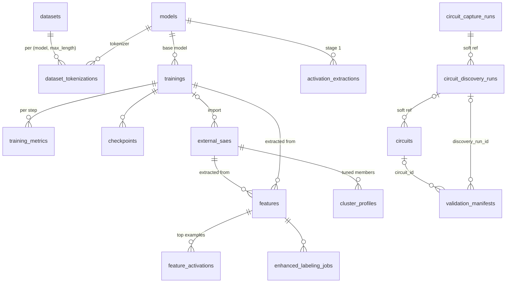

# Data Model

miStudio stores all metadata in PostgreSQL (heavy artifacts — weights, activations — live on the filesystem, referenced by path). This page maps the tables and their relationships. Every table in the ORM is listed here — enforced by `test_data_model_doc_covers_every_table`, which diffs this page against `Base.metadata` and fails when one is missing. (It previously claimed to be "verified against the ORM models" while omitting nine tables, including one its own ER diagram draws.)

## Pipeline tables

### `datasets`
`id UUID` · `name`, `source`, `hf_repo_id` · `status` (`downloading|processing|ready|error`) · `progress`, `error_message` · `raw_path`, `num_samples`, `size_bytes` · token-filter settings (`tokenization_filter_enabled`, `tokenization_filter_mode`, `tokenization_junk_ratio_threshold`) · `metadata` JSONB

### `dataset_tokenizations`
`id` = `tok_{dataset}_{model}_{maxlen}` · FKs `dataset_id`, `model_id` · `max_length`, `tokenized_path`, `tokenizer_repo_id`, `vocab_size`, `num_tokens`, `avg_seq_length` · `status` (`queued|processing|ready|error`) · `celery_task_id` · punctuation-filter options · **UNIQUE `(dataset_id, model_id, max_length)`** — one tokenization per model+length

### `models`
`id` = `m_{uuid}` · `name`, `repo_id` · `architecture` (family) + `architecture_config` JSONB (discovered dims) · `params_count` · `quantization` (`FP32|FP16|Q8|Q4|Q2`) · `status` (`downloading|loading|quantizing|ready|error`) · `file_path`, `quantized_path` · `memory_required_bytes`, `disk_size_bytes` · `celery_task_id`

### `trainings`
`id` = `train_{uuid}` · FK `model_id` · `dataset_id` **and** `dataset_ids` JSONB (multi-dataset) · `extraction_id` and `extraction_ids` JSONB (cached-activation training) · `status` (`pending|initializing|running|paused|completed|failed|cancelled`) · `progress`, `current_step`, `total_steps` · `hyperparameters` JSONB · live stats (`current_loss`, `current_l0_sparsity`, `current_dead_neurons`, `current_learning_rate`) · `celery_task_id`, `checkpoint_dir`, `finalized_from_step`, `error_traceback`

### `training_metrics`
`id BigInteger` · FK `training_id` · `step`, `timestamp`, `layer_idx` (NULL = aggregated series) · `loss`, `loss_reconstructed`, `loss_zero`, `l0_sparsity`, `l1_sparsity`, `dead_neurons`, `fvu`, `learning_rate`, `grad_norm`, `gpu_memory_used_mb`, `samples_per_second` · **UNIQUE `(training_id, step, layer_idx)`**

### `external_saes`
`id` = `sae_{uuid}` · `source` (`huggingface|local|trained`) · `status` (`pending|downloading|converting|ready|error|deleted`) · HF fields (`hf_repo_id`, `hf_filepath`, `hf_revision`) · `training_id` FK (nullable — external SAEs have none) · `model_name`, `model_id` FK, `layer`, `hook_type` · `n_features`, `d_model`, `architecture` · `format` (e.g. `community_standard`) · `local_path`, `file_size_bytes` · `sae_metadata` JSONB

## Feature tables

### `features`
`id` = `feat_{training}_{neuron}` or `feat_sae_{sae}_{neuron}` · FKs `training_id` / `external_sae_id` (one nullable), `extraction_job_id`, `labeling_job_id` · `neuron_index` · `name`, `category`, `description`, `notes` · `label_source` (`auto|user|llm|local_llm|openai|enhanced_llm`) · indexed stats: `activation_frequency`, `interpretability_score`, `max_activation`, `mean_activation` · `is_favorite`, `star_color` (`yellow|purple|aqua|null`) · `example_tokens_summary` JSONB, `nlp_analysis` JSONB

### `feature_activations`
Composite PK `(id, feature_id)`, **range-partitioned by `feature_id`** for scale · `sample_index`, `max_activation` · `tokens` + `activations` JSONB (per-token values) · context split: `prefix_tokens` / `prime_token` / `suffix_tokens`, `prime_activation_index`

## Circuit & cluster tables

The circuit subsystem records discovered cross-layer structures and the tuned clusters that steer them. Heavy artifacts (capture event stores) live on the filesystem under `/data/circuit_captures/{id}/`; these tables hold the metadata and contract-shaped JSONB snapshots.

### `circuits`
`id` = `crc_{hex12}` · `name`, `narrative` (markdown), `granularity` (`feature|cluster`) · contract-shaped JSONB snapshots mirroring `mistudio.circuit-definition/v1`: `saes`, `members`, `edges`, `budget`, `faithfulness`, `calibration` (the two-detector usable-band result — onset, correctness cliff, clamped intensity range; IDL-37), `discovery` (provenance) · `rung` (denormalized min-over-edges evidence rung) · `promoted` (a promoted circuit **is** the loadable multi-layer steering profile) · `version` (optimistic-concurrency — a stale write 409s) · `discovery_run_id` (soft ref) · `model_id`, `model_hf_id` (cross-instance-stable) · faithfulness lifecycle (`faithfulness_status` `pending|running|completed|failed`, `faithfulness_task_id`) · **calibration lifecycle** (`calibration_status` `pending|running|completed|failed`, `calibration_task_id`) · `schema_version` · `created_at`, `updated_at` · index `(promoted, rung)`

### `circuit_capture_runs`
`id` = `cap_{hex12}` · `status` (`pending|estimating|running|completed|failed|cancelled`), `progress` (0–100), `error_message` · `manifest` JSONB (mirrors the on-disk `manifest.json`: corpus refs, per-layer SAE/threshold, split, counts, SAE fingerprints, optional attention capture) · `store_path`, `events_total`, `bytes_total` · `stale` (flagged, not deleted, when a referenced SAE changes) · `celery_task_id` · `created_at`, `updated_at`

### `circuit_discovery_runs`
`id` = `dsc_{hex12}` · `capture_run_id` (soft ref) · `status`, `progress`, `error_message` · `params` JSONB (granularity, seeded/open mode, seed refs, `s_min`, null shuffles, FDR `q`, cohesion floor) · `report` JSONB (null summary, FDR discipline, held-out replication rate, counts-by-stage, attribution envelope) · `candidates` JSONB (both orderings — coactivation-only and attribution-re-ranked; cap 2000) · **separate attribution lifecycle** (`attribution_status`, `attribution_progress`, `attribution_error`, `attribution_task_id`) · **separate validation lifecycle** (`validation_status`, `validation_progress`, `validation_error`, `validation_task_id`) · `celery_task_id` · `created_at`, `updated_at`

### `validation_manifests`
`id` = `vman_{hex12}` · `kind` (`edge_batch|faithfulness|reproduction|calibration|steering_samples`) · self-contained: soft parent refs `discovery_run_id`, `circuit_id`, `parent_manifest_id` (a reproduction → its source) · `payload` JSONB (everything needed to REPRODUCE the run — intervention config, baseline, prompts, seeds, cfg, null summary, per-edge/member values, `metric_id`) · `created_at` · indexes on `discovery_run_id` and `circuit_id`

:::note Manifests are the record, not a live join
A manifest carries no drift-prone live references — reproduction is the correctness test. Manifest ids travel into the portable circuit contract as `validation_manifest_ref`, so an exported circuit's causal claims point at a reproducible record.
:::

### `steering_record_runs`
In-flight marker for the Steered Transcript Recorder (records `(dial, prompt, unsteered, steered)` transcripts for a strong model to analyze after the run). A record job loads the GPU like calibration, so it must be visible to the single-GPU guard — but it may target a cluster or ad-hoc feature set with no circuit row, so the marker lives here.
`id` = `srr_{hex12}` · `status` (`pending|running|completed|failed`), `task_id` · `artifact_kind` (`circuit|cluster|features`), `artifact_ref` (circuit id / cluster-profile id; `null` for a bare feature set) · `manifest_ref` (the `steering_samples` manifest it produced) · `error` · `created_at`, `updated_at`

### `cluster_profiles`
`id` = `clp_{hex12}` · `sae_id` FK → `external_saes` (`RESTRICT` on delete; nullable for imported-unbound profiles) · `model_id`, `extraction_id` (soft context), `source_group_id` (soft ref — grouping tables are recomputable and must not destroy tuned work) · `name`, `narrative` (markdown), `display_token` · `members` JSONB (per-member `feature_idx`, `label`, `similarity`, `activation_frequency`, `max_activation`, `strength`, `sign`, `pinned`) · `budget` JSONB (`B`, `B_dir`, `G`, `f_eff`, `formula_id`, `constants`, `intensity`, `intensity_range`) · `schema_version` · `imported_from` JSONB (import provenance) · `created_at`, `updated_at` · index `(sae_id, name)` · serializes to `mistudio.cluster-definition/v1`

## Job & support tables

| Table | Purpose |
|-------|---------|
| `activation_extractions` | Stage-1 raw-activation capture jobs (per model) |
| `extraction_jobs` | Stage-2 SAE→feature extraction jobs |
| `labeling_jobs` | Bulk labeling runs |
| `enhanced_labeling_jobs` | Per-feature two-pass labeling runs |
| `labeling_trial_runs` | Prompt-template A/B results over a fixed feature panel. A trial writes labels **here only** — never onto `features` — so comparing template variants cannot destroy the labels under comparison. `panel_id` is content-addressed (`sha256(extraction_job_id \| sorted feature ids)`), so equal ids prove an identical panel and a comparison can refuse a mismatch. `labeling_job_id` is `ON DELETE SET NULL`: deleting the job that produced a measurement must not delete the measurement. |
| `neuronpedia_export_jobs` | ZIP export jobs |
| `neuronpedia_pushes` | Direct-push jobs (`push_{sae}_{ts}`, status `queued|preparing|pushing|completed|failed`) |
| `steering_experiments` | Saved steering results |
| `prompt_templates` | Steering prompt sets — `prompts` is a JSONB *array* (multi-prompt) |
| `training_templates`, `extraction_templates`, `labeling_prompt_templates` | Saved configurations |
| `app_settings` | Key-value settings; sensitive values AES-256-GCM encrypted |
| `task_queue` | Persistent background-job records backing the Monitor page |

:::note Two extraction tables, on purpose
`activation_extractions` (model → raw activations) and `extraction_jobs` (SAE → features) are distinct pipelines that share a word — see [The Extraction Pipeline](/concepts/extraction-pipeline).
:::

### `trainings.finalized_from_step`

Nullable integer. Set when a stopped run was finalized from a checkpoint, and
`NULL` for runs that completed normally.

A finalized run has `status = 'completed'` so the SAE import path unlocks, but
`progress` and `current_step` keep their real values. This column is what
distinguishes a salvaged run from one that reached `total_steps`, and it drives
the "Finalized early @ N" badge. See
[Training Lifecycle & Checkpoints](/core-workflow/training-lifecycle).

## Tables this page used to omit

Nine tables were undocumented until MIS-E2E-050. Three of them mattered
particularly: `checkpoints` is drawn in this page's own ER diagram above and had
no entry; the four `feature_group*` / `feature_token_index` tables back three
shipped features and the entire Feature Groups panel; and
`agent_approval_requests` is the gate deciding whether an MCP agent's
destructive action needs a human.

| Table | Purpose |
|---|---|
| `checkpoints` | Per-step training checkpoints — loss, L0, weights path. One row per layer per step on a multi-layer run. Drawn in the ER diagram above; subject to step-granular retention (see [Training Lifecycle](/core-workflow/training-lifecycle)). |
| `feature_groups` | A cluster of related features (PPRD rows 13–15) |
| `feature_group_members` | Membership rows joining a feature to its group, with per-member strength and similarity |
| `feature_grouping_runs` | One execution of the grouping algorithm, with its parameters |
| `feature_token_index` | Token → feature index backing token search and the TF-IDF context subgrouping |
| `feature_analysis_cache` | Cached per-feature analyses (logit lens, correlations, NLP) with a 7-day expiry. Unique on `(feature_id, analysis_type)` — a blind INSERT here caused a production 500 once the expiry made a row invisible to the read but still present in the table. |
| `feature_dashboard_data` | Precomputed dashboard payloads (logit-lens and histogram blobs) |
| `agent_approval_requests` | The MCP approval gate: an agent's destructive action parked for human approval |
| `dismissed_operations` | Operations the user has dismissed from the Monitor page, so they stay dismissed |

`alembic_version` (migration bookkeeping) and `feature_activations_default` (the
default partition of `feature_activations`) are deliberately not described: one
belongs to Alembic and the other is an implementation detail of a partitioned
table already documented above.
